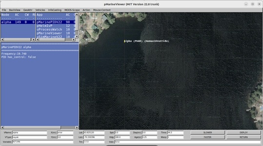

#  Instalacja środowiska MOOS-IVP 

1.  Przygotuj maszynę wirtualną według poniższych wymagań:

    a.  OS: Ubuntu x64

    b.  RAM: minimum 4GB

    c.  Pamięć: Dysk VHD o pojemności minimum 20GB

    d.  Zainstalowane VBoxGuestAdditions

2.  Instalacja MOOS-IVP:

    a.  Zainstaluj narzędzie Subversion za pomocą poniższego polecenia:

> sudo apt-get install subversion

b.  W katalogu „Pulpit" wykonaj poniższe polecenie (wykonaj je używając
    uprawnień zwykłego użytkownika):

> svn co https://oceanai.mit.edu/svn/moos-ivp-aro/trunk/ moos-ivp
>
> w wyniku działania narzędzia Subversion zostanie pobrany na pulpit
> katalog o nazwie „moos-ivp"

c.  Wykonaj poniższe polecenia w celu instalacji dodatkowych pakietów.

> sudo apt-get install g++ cmake xterm
>
> sudo apt-get install libfltk1.3-dev freeglut3-dev libpng-dev
> libjpeg-dev
>
> sudo apt-get install libxft-dev libxinerama-dev libtiff5-dev

d.  Za pomocą terminala przejdź do katalogu „moos-ivp" i wykonaj w nim
    skrypt „build-moos.sh"

e.  Po zakończeniu wykonywania poprzedniego skryptu uruchom skrypt
    „build-ivp.sh"

f.  Powróć do katalogu „Pulpit" i pobierz katalog „moos-ivp-extend" za
    pomocą poniższego polecenia:

> svn co https://oceanai.mit.edu/svn/moos-ivp-extend/trunk
> moos-ivp-extend

g.  Podobnie jak w przypadku poprzedniego katalogu należy wykonać
    znajdujący się w nim skrypt „build.sh"

3.  Edycja pliku „.bashrc"

    a.  W terminalu przejdź do katalogu „moos-ivp" i za pomocą polecenia
        „pwd" wyświetl jego pełną ścieżkę. Zapisz otrzymany wynik.

    b.  Powtórz tą czynność dla katalogu „moos-ivp-extend"

    c.  Za pomocą edytora nano otwórz plik „.bashrc"

    d.  Na końcu pliku dodaj poniższe linie wpisując wcześniej zapisane
        ścieżki do katalogów

> export PATH=\"/path/to/moos-ivp/bin:\$PATH"
>
> export PATH=\"/path/to/moos-ivp/scripts:\$PATH"
>
> export PATH=\"/path/to/moos-ivp-extend/bin:\$PATH"

e.  Zapisz plik oraz przeładuj powłokę za pomocą polecenia

> source .bashrc

4.  Weryfikacja poprawności działania środowiska

    a.  Przejdź do katalogu „/Pulpit/moos-ivp/ivp/missions/s1_alpha"

    b.  W terminalu wpisz polecenie

> pAntler alpha.moos
>
wynikiem działania polecenia jest wyświetlenie aplikacji pMarineViewer

c.  Aby zatrzymać aplikację przejdź do okna terminala i użyj kombinacji\
    klawiszy „ctrl + c"

5.  Tworzenie repozytorium git

    a.  Zainstaluj pakiet git za pomocą polecenia:

> sudo apt-get install git

b.  W katalogu moos-ivp-extend utwórz nowe repozytorium (polecenie git
    init)

c.  Skonfiguruj repozytorium za pomocą poniższych poleceń:

> git config \--global user.email \"toja@example.com\"
>
> git config \--global user.name \"Twoje Imię Nazwisko\"

d.  Dodaj wszystkie pliki znajdujące się w folderze do repozytorium
    (polecenie git add \*)

e.  Dokonaj pierwszego commita za pomocą polecenia

> git commit -m „first commit "

f.  Utwórz nowe prywatne repozytorium na portalu github o następującej
    nazwie \[gr_szkol\]\_\[Nazwisko\](pomiń nawiasy kwadratowe). Do tej
    czynności możesz użyć istniejącego konta lub utworzyć nowe.

g.  Połącz repozytorium lokalne z repozytorium na portalu github

h.  Przygotuj plik .gitignore w taki sposób aby do repozytorium trafiała tylko zawartość katalogów moos-ivp-extend/src i moos-ivp-extend/missions 

i.  Prześlij repozytorium lokalne na github

j.  W zakładce Settings-\>Collaborators dodaj konto wskazane przez
    wykładowcę
