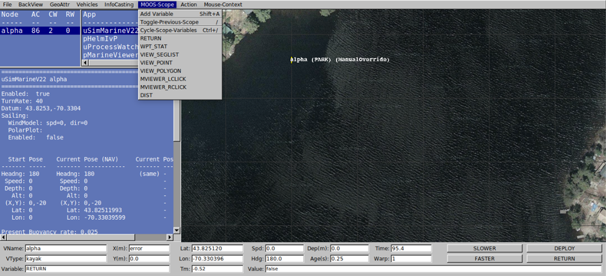

# Przygotowanie pierwszej aplikacji w środowisku MOOS-IVP

Zadanie laboratoryjne polega na przygotowaniu aplikacji działającej w
środowisku MOOS-IVP. Ma ona za zadanie zliczyć całkowity przebyty przez
pojazd dystans. Poniższe punkty przeprowadzą Cię przez proces
generowania i przygotowania aplikacji do poprawnego działania podczas
misji.

1.  Za pomocą poniższego polecenia wygeneruj aplikację o nazwie Zad1 w
    katalogu moos-ivp-extend/src

> GenMOOSApp_AppCasting Nazwa_Aplikacji p "Imie NAZWISKO"

2.  W pliku CMakeLists.txt dodaj podkatalog katalog zawierający twoją
    aplikację

3.  Plik Zad1.cpp zawiera kod aplikacji natomiast w pliku Zad1.h
    przechowywane są deklaracje używanych w programie zmiennych. Dodaj
    do pliku \*.h pięć zmiennych: curr_x, curr_y, prev_x, prev_y, dst.
    Wszystkie zmienne muszą być typu double.

4.  Plik \*.cpp podzielony jest na metody. W pierwszej kolejności
    zmodyfikuj metodę registerVariables() rejestrując się na zmienne
    „NAV_X" oraz „NAV_Y".

5.  Następnie zmodyfikuj metodę OnNewMail() tak aby pobierała ona
    wartości zmiennych NAV_X i NAV_Y do zmiennych lokalnych curr_x i
    curr_y.

6.  W metodzie Iterate() przygotuj kod wyliczający całkowity dystans
    przebyty przez pojazd.

7.  Zbuduj aplikację za pomocą skryptu build.sh znajdującego się w
    katalogu moos-ivp-extends

8.  Skopiuj do katalogu moos-ivp-extends/missions misję s1_alpha
    znajdująca się w katalogu moos-ivp/ivp/missions

9.  W skopiowanym katalogu dodaj do pliku o rozszerzeniu .moos w bloku
    konfiguracji Antlera swoją aplikację. W bloku konfiguracji
    MarineViewer dodaj zmienną DIST do scope.

10. Uruchom aplikację za pomocą wcześniej poznanego polecenia pAntler.

11. W oknie pMarineViewera wybierz z opcji MOOS Scope a następnie
    zmienną DIST

> 

12. Nazwa zmiennej zostanie pokazana w komórce Vairable w lewym dolnym
    rogu ekranu, jej wartość natomiast w komórce Value.

13. Naciśnij przycisk Deploy i sprawdź poprawność działania aplikacji.

14. Wyczyść logi za pomocą skryptu clean.sh

15. Udostępnij lokalne repozytorium na portal github
