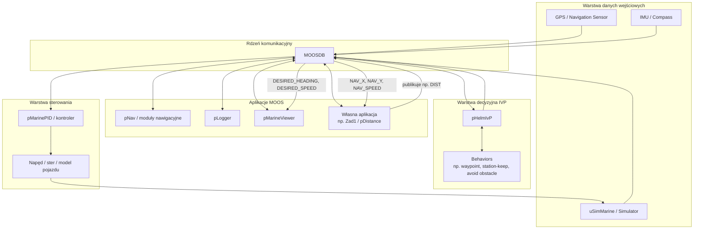

# Diagram architektury MOOS-IVP

Poniższy diagram przedstawia uproszczoną architekturę środowiska **MOOS-IVP**.  
Centralnym elementem systemu jest **MOOSDB**, która pośredniczy w komunikacji pomiędzy wszystkimi aplikacjami.

## Opis elementów

- **MOOSDB** – centralna baza wiadomości, przez którą komunikują się wszystkie aplikacje.
- **uSimMarine** – symulator pojazdu, publikujący dane nawigacyjne i odbierający komendy sterujące.
- **pHelmIvP** – moduł decyzyjny wybierający zachowanie pojazdu na podstawie aktywnych behaviorów.
- **Behaviors** – reguły sterowania, np. podążanie po waypointach lub utrzymywanie pozycji.
- **pMarinePID** – kontroler zamieniający komendy zadane na sygnały sterujące.
- **pMarineViewer** – narzędzie do wizualizacji stanu misji i podglądu zmiennych z MOOSDB.
- **pLogger** – zapisuje przebieg misji do logów.
- **Własna aplikacja** – program tworzony przez studenta, który może subskrybować i publikować własne zmienne.

## Typowy przepływ danych

1. Symulator lub sensory publikują dane, np. `NAV_X`, `NAV_Y`, `NAV_HEADING`.
2. Dane trafiają do **MOOSDB**.
3. **pHelmIvP** odczytuje dane i wyznacza komendy zadane, np. `DESIRED_SPEED`, `DESIRED_HEADING`.
4. Komendy trafiają przez **MOOSDB** do kontrolera.
5. Kontroler steruje ruchem pojazdu.
6. Własne aplikacje mogą równolegle analizować dane i publikować nowe zmienne.
7. **pMarineViewer** oraz **pLogger** obserwują przebieg misji.

## Przykład dla aplikacji studenckiej

Aplikacja licząca przebyty dystans może działać według schematu:

- odbiera `NAV_X`
- odbiera `NAV_Y`
- oblicza odległość między kolejnymi pozycjami
- publikuje wynik do zmiennej `DIST`

Wtedy zmienna `DIST` może być obserwowana w **pMarineViewer** przez **MOOS Scope**.
