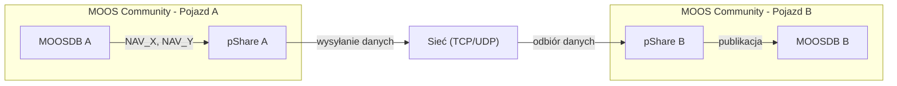

# Instrukcja: Aplikacja pShare w MOOS-IVP

## Cel instrukcji

Celem tej instrukcji jest zapoznanie studenta z aplikacją **pShare**, która umożliwia wymianę danych pomiędzy różnymi społecznościami MOOS (MOOS Communities), np. między pojazdami lub między pojazdem a stacją bazową.

## Czym jest pShare?

**pShare** to aplikacja wchodząca w skład MOOS-IVP, odpowiedzialna za:

- przekazywanie danych pomiędzy różnymi MOOSDB,
- realizację komunikacji sieciowej między procesami działającymi na różnych maszynach,
- filtrowanie i mapowanie zmiennych.

## Zastosowanie pShare

pShare jest wykorzystywane m.in. do:

- komunikacji między wieloma pojazdami,
- przekazywania pozycji (`NAV_X`, `NAV_Y`) między jednostkami,
- synchronizacji danych między systemami,
- budowy systemów multi-agentowych.

## Jak działa pShare?

pShare:

1. Subskrybuje zmienne w lokalnym MOOSDB,
2. Wysyła wybrane zmienne przez sieć (TCP/UDP),
3. Odbiera dane z innych społeczności MOOS,
4. Publikuje je lokalnie jako zmienne MOOS.

## Konfiguracja pShare

```moos
ProcessConfig = pShare
{
  AppTick   = 4
  CommsTick = 4

  input = route = localhost:9001 

  output = src_name=VAR_A, dest_name=VAR_B, route=localhost:9000 
}
```
Linia `input = route = localhost:9001` ustawia aplikację `pShare` w tryb nasłuchu na ustalonym porcie IPv4. Ważne aby adres IP był zgodny z adresem IP podanym w pliku konfiguracyjnym `*.moos`.

Linia `output = src_name=VAR_A, dest_name=VAR_B, route=localhost:9000` za pomocą `src_name` wybiera zmienną z lokalnego MOOS_DB jaką ma przesyłać, parametr `dest_name` określa pod jaką nazwą ma zostać ona wysłana i opublikowana w docelowym MOOS_DB. Ostatni człon lini `route` określa gdzie dana zmienna ma zostać wysłana, określa się za jego pomocą adres IPv4 oraz port na jakim nasłuchuje aplikacja pShare z innej rodziny MOOSowej.

## Przykład

```moos
ProcessConfig = pShare
{
  input = route = localhost:9001 

  output = src_name=NODE_REPORT_LOCAL, dest_name=NODE_REPORT, route=192.168.1.2:9000
}
```

## Diagram komunikacji pShare




## Podsumowanie

pShare umożliwia komunikację między społecznościami MOOS i jest kluczowym elementem systemów wielopojazdowych.
